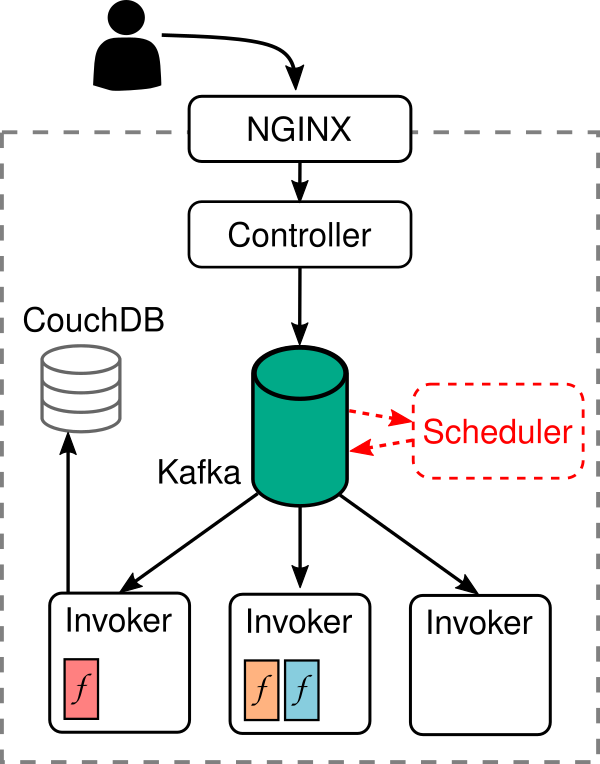

This is an extension of [Apache OpenWhisk](https://openwhisk.apache.org/) that
introduces mechanisms and policies to support differentiated service classes and
QoS enforcement.

Our main contribution consists of the **Scheduler** component, which is
responsible for managing a queue of pending activations and scheduling them 
to the available Invokers according to a given policy. 
The scheduler currently supports the following scheduling policies:
 - priority-based FIFO
 - shortest-job-first (SJF)

The scheduler introduces additional mechanisms to improve the system
throughput in overload scenarios, especially as regards function compositions.

Further information on the design and implementation of the project can be found 
in the following paper:

>Gabriele Russo Russo, Alfredo Milani, Stefano Iannucci and Valeria
>Cardellini, 
>**Towards QoS-Aware Function Composition Scheduling in Apache OpenWhisk**.
>Proceedings of the 1st *LESS Workshop, March 2021. To appear.

## Getting the source code

The associated source code is available in **two GitHub repositories**.

The source code for the Scheduler and basic instructions for its usage
can be found in the [here](https://github.com/alfredo-milani/openwhisk-scheduler).

Some of the introduced extensions require modifications of OpenWhisk
components, i.e., the Controller and the Invoker. The extended version of
OpenWhisk core is available in this
[repository](https://github.com/alfredo-milani/openwhisk).

## Authors

The project has been developed by Alfredo Milani, with the collaboration of
[Valeria Cardellini](http://www.ce.uniroma2.it/~valeria), [Stefano Iannucci](https://scholar.google.com/citations?user=faF-XgoAAAAJ) and [Gabriele Russo Russo](http://www.ce.uniroma2.it/~russorusso).

## License

This project is distributed under the terms of Apache License, Version 2.0 (the "License"); you may not use these files except in compliance
with the License. You may obtain a copy of the License at <a href="http://www.apache.org/licenses/LICENSE-2.0">http://www.apache.org/licenses/LICENSE-2.0</a>. See the NOTICE file distributed with this work for additional information regarding copyright ownership. Unless required by applicable law or agreed to in writing, software distributed under the License is distributed on an "AS IS" BASIS, WITHOUT WARRANTIES OR CONDITIONS OF ANY KIND, either express or implied.  See the License for the specific language governing permissions and limitations under the License.

